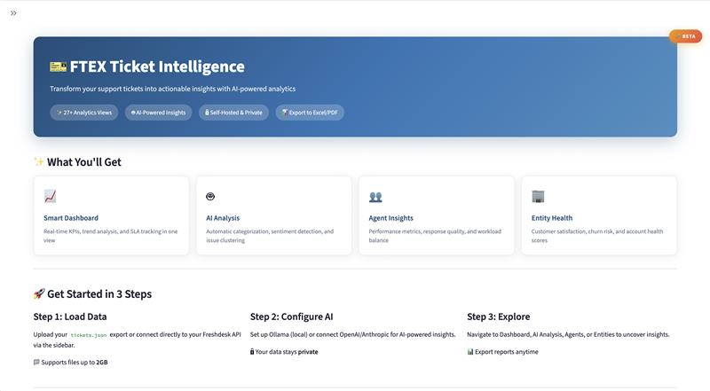

# 🎫 FTEX Ticket Intelligence Platform

> **AI-Powered Support Analytics for Everyone**

Open-source, self-hosted ticket analytics platform with AI-powered insights, interactive dashboards, and comprehensive reporting.

[](https://opensource.org/licenses/MIT)
[](https://www.python.org/downloads/)
[](https://streamlit.io/)

> 🔗 **Looking for the CLI version?** Check out [FTEX CLI](https://github.com/sahaib/FTEX)



## ✨ Features

### 📊 Comprehensive Analytics (27+ Views)
- **Executive Dashboard** - KPIs, trends, and alerts at a glance
- **AI Issue Clusters** - Automatically group similar tickets
- **SLA Performance** - Track first response and resolution times
- **Agent Performance** - Individual and team metrics
- **Customer Health** - Risk scoring and account analysis
- **Category Distribution** - Ticket types and trends
- **Canned Response Detection** - Template usage tracking
- **24h Promise Tracking** - "We'll get back" compliance
- **Weekend/Holiday Matrix** - Response gap analysis
- **Internal Dependencies** - Help request tracking
- And much more...

### 🤖 AI-Powered Insights
- Issue clustering and root cause analysis
- Automatic categorization
- Sentiment analysis (optional)
- Works with Ollama (local), OpenAI, or Anthropic

### ⚙️ Fully Configurable
- **Industry Presets**: Maritime, IT Support, SaaS, E-commerce
- **Custom Categories**: Define your own with keywords
- **SLA Thresholds**: By priority level
- **Holiday Calendars**: Multiple country support
- **Entity Mapping**: Track customers, vessels, sites, or products
- **🎨 Branding**: Custom logo, colors, and platform name

### 📈 Premium Analytics (Usually Paywalled)
- **First Contact Resolution (FCR)** - Resolved with ≤2 messages
- **Response Consistency** - Standard deviation scoring
- **Agent Utilization Rate** - Workload distribution
- **Ticket Touches** - Efficiency metrics
- **Complexity Score** - High/Urgent ticket handling
- **Activity Heatmaps** - Hour × Day and Agent × Metric matrices
- **Customer Coverage** - Diversity metrics

### 📤 Professional Reports
- **Excel Export**: 27-sheet comprehensive reports
- **PDF Reports**: Executive summaries
- **JSON/CSV**: Raw data export

## 🚀 Quick Start

### Option 1: Docker (Recommended)

```bash
# Clone the repository
git clone https://github.com/sahaib/FTEX.git
cd FTEX

# Copy environment file
cp .env.example .env
# Edit .env with your credentials

# Start with Docker Compose
docker-compose up -d

# Access at http://localhost:8501
```

### Option 2: Local Installation

```bash
# Clone the repository
git clone https://github.com/sahaib/FTEX.git
cd FTEX

# Create virtual environment
python -m venv venv
source venv/bin/activate  # Windows: venv\Scripts\activate

# Install dependencies
pip install -r requirements.txt

# Run the app
streamlit run app/main.py
```

### Option 3: One-Click Deploy

[](https://railway.app/template/...)
[](https://render.com/deploy)

## 📁 Project Structure

```
ftex/
├── app/
│   ├── main.py                 # Streamlit entry point
│   ├── pages/
│   │   ├── 1_📊_Dashboard.py   # Main analytics dashboard
│   │   ├── 2_🧠_AI_Analysis.py # AI issue clustering
│   │   ├── 3_📈_SLA_Metrics.py # SLA tracking
│   │   ├── 4_🏢_Entities.py    # Entity analysis
│   │   ├── 5_👤_Agents.py      # Agent performance
│   │   ├── 6_⚙️_Settings.py   # Configuration UI
│   │   └── 7_📥_Export.py      # Report generation
│   ├── components/             # Reusable UI components
│   └── core/
│       ├── config_manager.py   # YAML configuration
│       ├── data_loader.py      # Data processing
│       └── session_state.py    # State management
├── config/
│   ├── default.yaml            # Default settings
│   └── templates/              # Industry presets
├── data/
│   ├── uploads/                # User uploaded files
│   ├── cache/                  # Processed data cache
│   └── exports/                # Generated reports
├── docker-compose.yml
├── Dockerfile
└── requirements.txt
```

## ⚙️ Configuration

### Industry Presets

FTEX comes with presets for common industries:

| Preset | Primary Entity | Use Case |
|--------|---------------|----------|
| `general` | Customer | General helpdesk |
| `maritime` | Vessel | Shipping/maritime software |
| `it_support` | Customer | IT helpdesk |
| `saas` | Customer | SaaS product support |
| `ecommerce` | Customer | E-commerce support |

### Custom Configuration

Create `config/user/config.yaml`:

```yaml
industry:
  name: My Company
  preset: custom
  primary_entity: site
  entity_field: cf_site_name

sla:
  first_response_hours: 4
  resolution_hours: 24
  stale_threshold_days: 7

categories:
  custom:
    - name: Hardware Issue
      keywords: [hardware, laptop, monitor, printer]
    - name: Software Issue
      keywords: [software, application, crash, error]
```

### Environment Variables

```bash
# Freshdesk Integration
FRESHDESK_DOMAIN=your-company
FRESHDESK_API_KEY=your-api-key
FRESHDESK_GROUP_ID=12345  # Optional

# AI Configuration
OLLAMA_URL=http://localhost:11434
OLLAMA_MODEL=qwen2.5:14b

# Or use OpenAI
OPENAI_API_KEY=sk-...
```

## 📊 Report Sheets

The Excel export includes 27 comprehensive sheets:

| # | Sheet | Description |
|---|-------|-------------|
| 1 | Executive Summary | Key metrics overview |
| 2 | All Tickets | Complete ticket listing |
| 3 | WGB Tickets | "We'll Get Back" tracking |
| 4 | Stale Tickets | >15 days without update |
| 5 | Multi-Issue Tickets | Tickets with multiple issues |
| 6 | Category Analysis | Distribution and metrics |
| 7 | SLA Performance | Compliance tracking |
| 8 | By Company | Company breakdown |
| 9 | Status & Priority | Distribution analysis |
| 10 | SLA Breaches | Breach details |
| 11 | Time Analysis | Day/hour patterns |
| 12 | Response Quality | Message metrics |
| 13 | Customer Health | Health scoring |
| 14 | At-Risk Accounts | Attention required |
| 15 | Workload | Backlog analysis |
| 16 | Entities | Entity breakdown |
| 17 | Products | Product analysis |
| 18 | Bugs | Bug tracking |
| 19 | Features | Feature requests |
| 20 | Risk Dashboard | Risk indicators |
| 21 | Weekly Summary | Weekly report |
| 22 | Agents | Agent performance |
| 23 | Canned Responses | Template usage |
| 24 | Config Issues | Configuration problems |
| 25 | 24h Promises | Promise tracking |
| 26 | Weekend-Holiday | Gap analysis |
| 27 | Dependencies | Internal help requests |

## 🤖 AI Configuration

### Ollama (Local, Free)

```bash
# Install Ollama
curl -fsSL https://ollama.com/install.sh | sh

# Pull a model
ollama pull qwen2.5:14b

# Start Ollama
ollama serve
```

### OpenAI

Set your API key in Settings or via environment:
```bash
export OPENAI_API_KEY=sk-...
```

## 📖 Documentation

- [Getting Started Guide](docs/getting-started.md)
- [Configuration Reference](docs/configuration.md)
- [API Documentation](docs/api.md)
- [Contributing Guide](CONTRIBUTING.md)

## 🤝 Contributing

Contributions are welcome! Please see our [Contributing Guide](CONTRIBUTING.md).

```bash
# Fork and clone
git clone https://github.com/YOUR_USERNAME/FTEX.git

# Create branch
git checkout -b feature/amazing-feature

# Make changes and test
pytest

# Commit and push
git commit -m "Add amazing feature"
git push origin feature/amazing-feature

# Open Pull Request
```

## 📝 License

MIT License - see [LICENSE](LICENSE) for details.

## 🙏 Acknowledgments

- [Streamlit](https://streamlit.io/) - The amazing web framework
- [Plotly](https://plotly.com/) - Interactive visualizations
- [Ollama](https://ollama.com/) - Local LLM inference
- All our contributors!

---

**Made with ❤️ by the FTEX community**

[GitHub](https://github.com/sahaib/FTEX) | [Documentation](https://ftex.readthedocs.io) | [Issues](https://github.com/sahaib/FTEX/issues)
